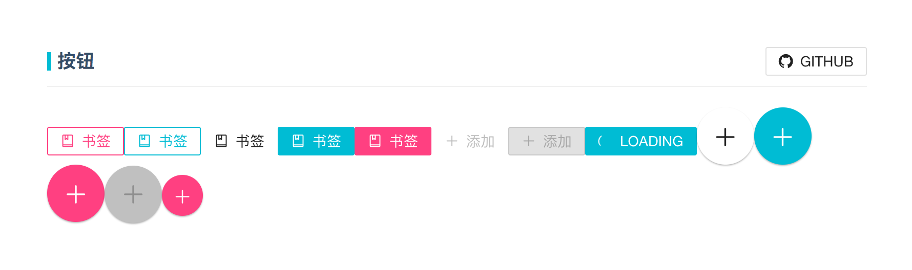
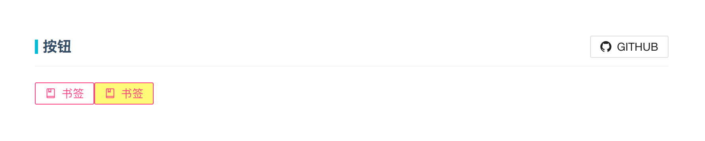
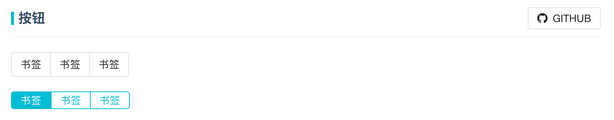

## Button

[cqaso](http://cqaso.com/) Button组件在html按钮模型的基础之上，重新对按钮表单元素进行审视和设计，它在包含文字，图标字体，颜色主题，行为样式之外，添加**水波纹过渡动画**，额外让按钮的行为样式在页面展示中别具一格。让我们一起来学习cqaso Button组件吧。

	<!-- example -->
	import { Button } from 'react-cqtoolbox/lib/components/button';
	const ButtonTest = () => (
	

    	<Button
      		icon="book"
      		label="书签"
      		accent
      		onRippleEnded={rippleEnded} />
    	<Button
      		icon="book"
      		label="书签"
      		primary
      		onRippleEnded={rippleEnded} />
    	<Button
      		icon="book"
      		label="书签"
      		raised />
    	<Button
      		icon="book"
      		label="书签"
      		raised
      		primary />
    	<Button
      		icon="book"
      		label="书签"
      		raised
      		accent />
    	<Button
      		icon="plus"
      		label="添加"
      		disabled />
    	<Button
      		icon="plus"
      		label="添加"
      		raised
      		disabled />
    	<Button
      		icon="loading"
      		iconSpin
      		label="Loading"
      		raised
      		primary
      		rippleMultiple={false}
      		onRippleEnded={rippleEnded} />
    	<Button icon="plus" floating />
    	<Button icon="plus" floating primary />
    	<Button icon="plus" floating accent />
    	<Button icon="plus" floating primary disabled />
    	<Button icon="plus" floating accent mini />
	
);

### 属性

| 属性名             | 属性名                       | 默认值       | 描述|
|:------------------|:----------------------------|:------------|:------------------|
| `accent`          | `Boolean`                   | `false`     | Theme对象属性中的一员，指定按钮元素的字体以及边框的强调色.|
| `children`        | `node`                      |             | 指定Button组件元素框内包含的内容,若Button组件元素还设置label属性，则children内容跟在label内容的后面.|
| `className`       | `String`                    |             | 给Button组件元素设置一个class属性名.|
| `disabled`        | `Boolean`                   |             | 如果给Button组件元素设置该属性，Button组件元素丧失所有样式，成为不可编辑元素.|
| `flat`            | `Boolean`                   | `false`     | 如果设置该属性，Button组件元素会拥有扁平的外形效果. |
| `floating`        | `Boolean`                   | `false`     | 如果设置该属性，Button组件元素会拥有圆圈的外形效果. |
| `href`            | `String`                    |             | 给Button组件元素指定一个href链接属性，并且<button></button>元素会被编译成元素. |
| `size`            | `'small','normal','large'`  | `normal`    | 指定Button组件元素的大小，默认值是normal. |
| `icon`            | `String` or `Element`       |             | 指定Button组件元素的icon值（icon的值可以是描述图标字体的元素） |
| `iconSpin`        | `Boolean`                   |             | 如果Button组件元素设置了icon属性的前提之下，设置该属性，icon图标会顺时针动态旋转. |
| `label`           | `String`                    |             | 指定Buttton组件元素的标签内容|
| `mini`            | `Boolean`                   | `false`     | 用于设置了floating属性的Button组件元素，如果为true，Button元素会显的更小一点.|
| `neutral`         | `Boolean`                   | `true`      | 用于为button组件元素设置中立色，如果为true，Button组件元素会覆盖掉其他任何主题色调.|
| `onMouseEnter`    | `Function`                  |             | 指定鼠标进入Button组件元素区域的钩子函数.|
| `onMouseLeave`    | `Function`                  |             | 指定鼠标离开Button组件元素区域的钩子函数.|
| `onMouseUp`       | `Function`                  |             | 指定在Button组件元素区域释放鼠标的钩子函数.|
| `primary`         | `Boolean`                   | `false`     | Theme对象属性中的一员，指定按钮元素的字体以及边框的初始色.|
| `raised`          | `Boolean`                   | `false`     | 如果为true，Button组件元素的字体元素与Button组件元素的背景色对调. |
| `theme`           | `Object`                    |             | theme对象属性，用于对Button组件元素的样式颜色属性集中设置.|
| `type`            | `String`                    | `button`    | 用于设置Button组件元素的表单类型|

注意：***theme*** 属性可对Button组件元素的样式颜色集中设置，Button组件元素的某些属性的应用具有顺序性和对立性，Button组件元素属性的魔性由你来发现！

### Theme对象属性

| 属性名          | 描述|
|:---------------|:-----------|
| `accent`       | 指定按钮元素的字体以及边框的强调色，颜色值为rgb(255, 64, 129).|
| `button`       | 用于根元素是按钮的元素|
| `flat`         | 如果设置该属性，Button组件元素会拥有扁平的外形效果.|
| `floating`     | 如果设置该属性，Button组件元素会拥有圆圈的外形效果.|
| `icon`         | 指定Button组件元素的icon值（icon的值可以是描述图标字体的元素).|
| `mini`         | 用于设置了floating属性的Button组件元素，如果为true，Button组价元素会显的更小一点.|
| `neutral`      | 用于为button组件元素设置中立色，如果为true，Button组件元素会覆盖掉其他任何主题色调.|
| `primary`      | Theme对象属性中的一员，指定按钮元素的字体以及边框的初始色，颜色值为rgb(0, 188, 212).|
| `raised`       | 如果为true，Button组件元素的字体元素与Button组件元素的背景色对调.|
| `rippleWrapper`| 用于水波纹元素|
| `toggle`       | 用于切换元素的根元素|

#### Theme对象属性使用说明
Look here ！ 如果你想在cqaso Button组件的模板之上，想要拥有属于自己的Button组件行为样式主题，Theme对象属性帮你完全搞定，让我们来通过一个例子看看吧。

<!--example-->
1. 如果你想覆盖掉定义了accent属性定义的默认背景颜色rgba(0, 0, 0, 0)，那么在项目文件中，定义buttonTheme.css（可定义其他文件名）文件，在文件中，一定要使用 .accent 类名设置样式。
	<!--buttonTheme.css内容-->

		.accent{
			color:rgb(255,250,120);
		}

2. 然后在Button组件文件中，引入buttonTheme.css文件，在需要设置Button元素中设置theme属性，但是一定要包含已有accent属性，这时theme属性中的accent设置的样式才会覆盖已有accent默认颜色。

	<!--设置theme属性的例子-->

		import { Button } from 'react-cqtoolbox/lib/components/button';
		import theme from 'react-cqtoolbox/lib/theme/buttonTheme.css';
		const ButtonTest = () => (
			

				<Button
					icon="book"
					label="书签"
					className="coco"
					accent
					onRippleEnded={rippleEnded} />
				<Button
					icon="book"
					label="书签"
					className="coco"
					accent
					theme={theme}
					onRippleEnded={rippleEnded} />
			
);
3. 最后让我们一起看看效果。

	

***

## ButtonGroup

[cqaso](http://cqaso.com/) ButtonGroup组件在Button组件元素之上对Button组件元素进行包装和组合，让Button组件元素的使用逃离表单按钮的定性束缚。让我们一起来学习cqaso ButtonGroup组件吧。

	<!-- example -->
	import { ButtonGroup } from 'react-cqtoolbox/lib/components/button';
	const ButtonTest = () => (
		

      		<ButtonGroup>
        		<Button label="书签" onRippleEnded={rippleEnded}/>
        		<Button label="书签" onRippleEnded={rippleEnded}/>
        		<Button label="书签" onRippleEnded={rippleEnded}/>
      		</ButtonGroup>
    	

    	

      		<ButtonGroup size="small">
        		<Button primary raised label="书签" onRippleEnded={rippleEnded}/>
        		<Button primary label="书签" onRippleEnded={rippleEnded}/>
        		<Button primary label="书签" onRippleEnded={rippleEnded}/>
      		</ButtonGroup>
    	

	);

### 属性

| 属性名             | 属性名                                 | 默认值       | 描述|
|:------------------|:--------------------------------------|:------------|:------------------|
| `children`        | `node`                                |             | 用于指定ButtonGroup组件元素开始标签与结束标签中的文本内容，但是目前无效.|
| `size`            | `'small','normal','large'`            | `normal`    | 指定ButtonGroup组件元素的大小，默认值是normal.|
| `theme`           | `特定形状的参数对象{buttonGroup:String}` |             | 定义属于自己个性的ButtonGroup组件颜色样式.|

注意：***theme*** 对象属性具有一定的参数格式，如何定义属于自己的颜色样式主题，请参考Button组件的theme对象属性。
