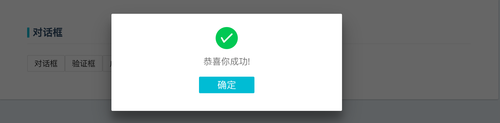

## 对话框(Dialog)

[cqaso](http://cqaso.com/) Dialog组件默认定义了普通对话框、验证框、成功框、警告框和错误框五种对话框，您可以通过Dialog组件提供的参数，个性化设置属于自己的对话框和对话框的后续操作，让我们一起来学习cqaso Dialog组件吧。

	class DialogTest extends React.Component {
		state = {
    		active: false,
    	};

    	handleDialog = () => {
    		this.setState({active: !this.state.active});
    	}

    	handleConfirm = () => {
    		Dialog.confirm({
      		content: '是否删除',
      		onConfirm: () => {
        		console.log('confirm...');
      		},
      		onCancel: () => {
        		console.log('cancel...');
      		}
    	});
    }

    handleSuccess = () => {
    	Dialog.success({
      		content: '恭喜你成功!',
      		onConfirm: () => {
        		console.log('confirm...');
      		},
    	});
    }

    handleWarning = () => {
    	Dialog.warning({
      		content: '警告!',
    	});
    }

    handleError = () => {
    	Dialog.error({
      		content: '服务器出错!',
    	});
    }

    actions = [
    	{ label: "取消", onClick: this.handleDialog },
    	{ label: "确定", onClick: this.handleDialog }
    ];

    render () {
    	return (
      		<Section title="对话框">
        		

          			<Button label='对话框' onClick={this.handleDialog} />
          			<Button label='验证框' onClick={this.handleConfirm} />
          			<Button label='成功框' onClick={this.handleSuccess} />
          			<Button label='警告框' onClick={this.handleWarning} />
          			<Button label='错误框' onClick={this.handleError} />

          	<Dialog
            	actions={this.actions}
            	active={this.state.active}
            	onEscKeyDown={this.handleDialog}
            	onOverlayClick={this.handleDialog}
            	title='对话框标题'>
            	
在这里您可以添加任意内容。像Pickers这样的组件现在使用对话框。

          	</Dialog>
        

      </Section>
    );}

### 属性

| 属性名             | 属性名                       | 默认值       | 描述|
|:------------------|:----------------------------|:------------|:------------------|
| `actions`         | `Array`                     | `[]`          | 对象数组[{className,label,children}].允许随意组合，定义对话框的按钮导航区域，添加一个属性元素，对话框添加一个导航按钮，建议使用label元素添加导航按钮.|
| `title`           | `node`                      |             | 指定Dialog对话框标题内容.|
| `active`          | `Boolean`                   | `false`     | 指定Dialog对话框的展示与隐藏.|
| `children`        | `node`                      |             | 用于指定Dialog组件元素开始标签和结束标签之间的内容，不建议使用.|
| `className`       | `string`                    | `false`     | 给Dialog组件元素添加class属性值. |
| `onEscKeyDown`    | `func`                      | `false`     | 指定Dialog对话框，点击取消导航按钮的执行的回调函数. |
| `onOverlayClick`  | `func`                      |             | 指定Dialog对话框，点击确认导航按钮的执行的回调函数. |
| `theme`           | `特定形状的参数对象`           |             | 用于个性化设置Dialog对话框，详情请查阅下文中的Theme对象属性. |
| `type`            | `'small','normal','large','fullscreen'`   |   `normal`        | 指定Dialog组件元素的大小，默认值是normal. |

注意：***onEscKeyDown、onOverlayClick*** 属性用于指定Dialog组件元素中导航按钮需要执行的回调函数； ***Theme*** 对象属性中，可自定义Dialog组件元素的默认显示行为，整个Dialog组件的样式颜色。

### Theme对象属性

| 属性名          | 描述|
|:---------------|:-----------|
| `active`       | 用于指定自定义对话框的是否隐藏.|
| `body`         | 用于设定自定义对话框的body样式.|
| `button`       | 用于指定自定义对话框的button样式.|
| `dialog`       | 用于指定自定义对话框的dialog样式.|
| `navigation`   | 用于指定自定义对话框的navigation样式.|
| `overlay`      | 用于覆盖组件的根元素.|
| `title`        | 用于指定自定义对话框的title样式.|
| `wrapper`      | 用于指定自定义对话框的wrapper样式.|

#### Theme对象属性使用说明
Look here ！ 如果你想在cqaso Dialog组件的模板之上，想要拥有属于自己的Dialog组件行为样式主题，Theme对象属性帮你完全搞定，使用原理请参照Button组件Theme属性的设定。
